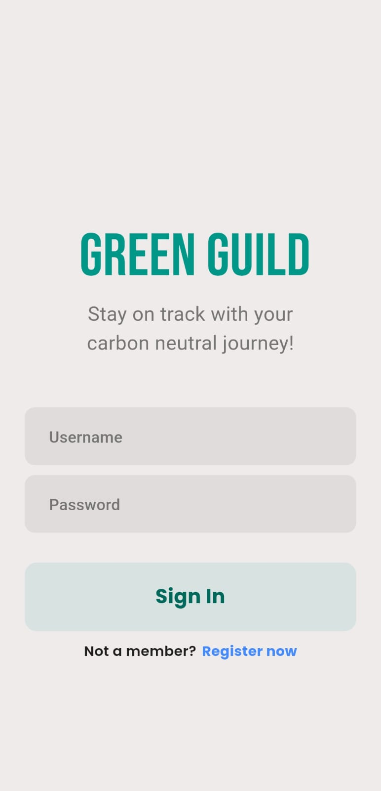
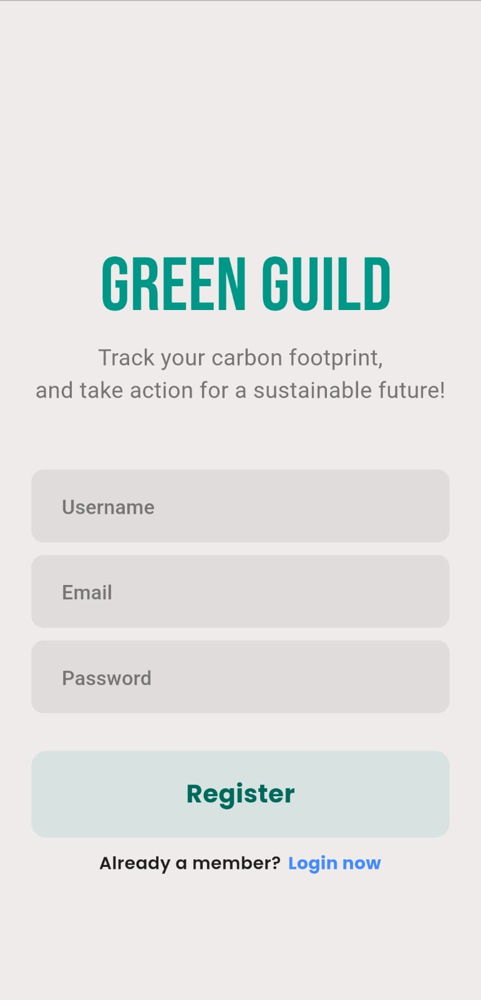
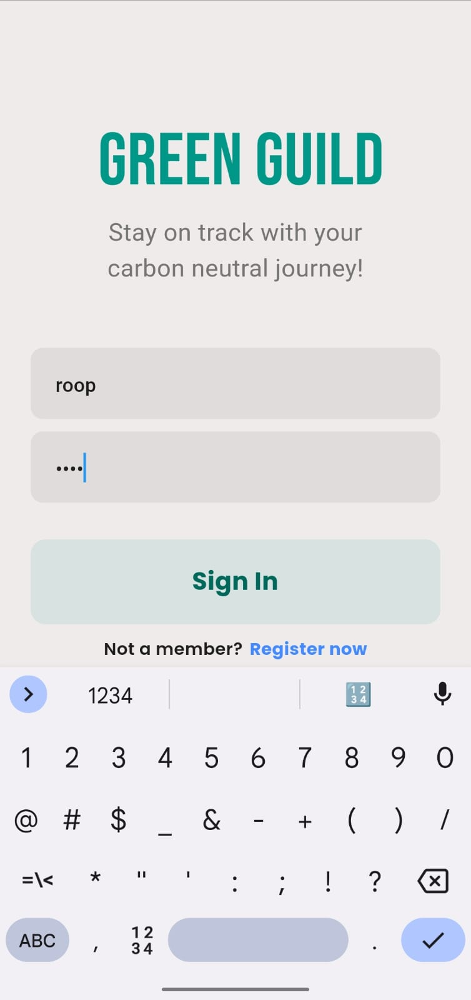
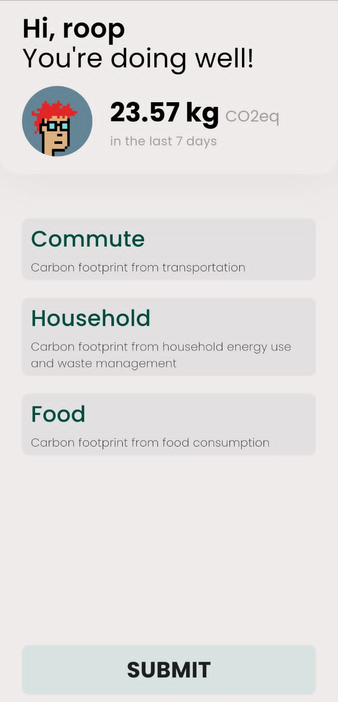
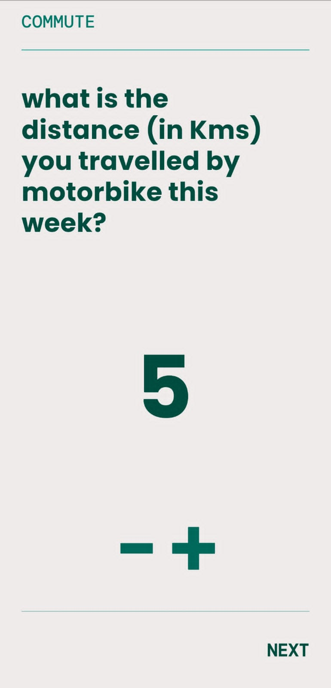
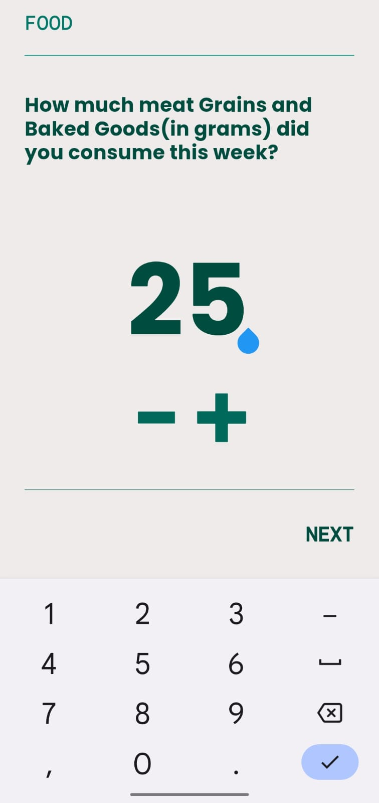
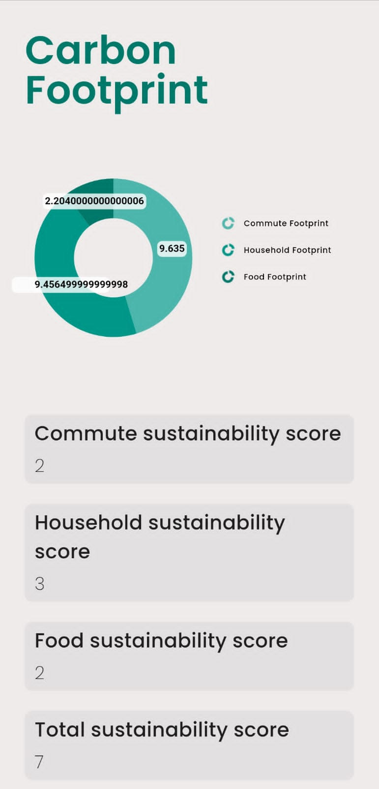
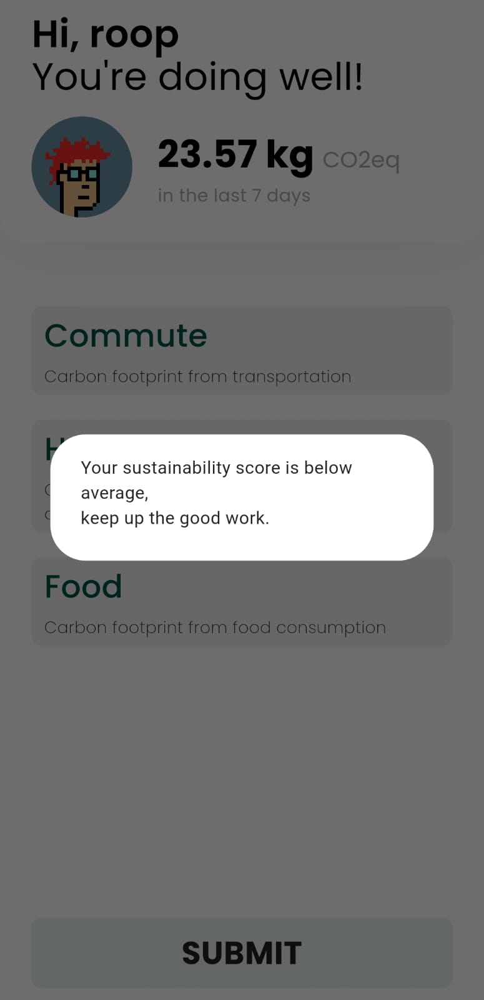

# Green Guild

Green Guild is an environmentally conscious application that helps individuals track and reduce their carbon emissions/carbon footprints to mitigate the impact of climate change on the environment. It also aims to educate people about the carbon emissions associated with various activities and empowers individuals to take action to reduce their carbon footprint.

## Demo

<!-- You can optionally provide a link to a demo video or live demo of the application -->

Here are some demo images of the Green Guild application:

|                        |                        |                        |                        |
| ---------------------- | ---------------------- | ---------------------- | ---------------------- |
|  |  |  |  |
|  |  |  |  |

## Tech Stack

- Backend: Django / REST APIs
- Frontend: Flutter

## Libraries and Dependencies

Flutter Dependencies:

- http: ^0.13.5
- provider: ^6.0.5
- syncfusion_flutter_charts: ^21.1.39
- google_fonts: ^4.0.3

Backend Dependencies:

- Django==4.2
- dnspython==2.3.0
- sqlparse==0.4.3

## Usage

To use Green Guild, follow these steps:

1.  Launch the Green Guild app on your device or emulator.
2.  Explore the different features to track and analyze your carbon emissions.
3.  Gain insights into the carbon emissions associated with various activities.
4.  Empower yourself to take action and reduce your carbon footprint.
